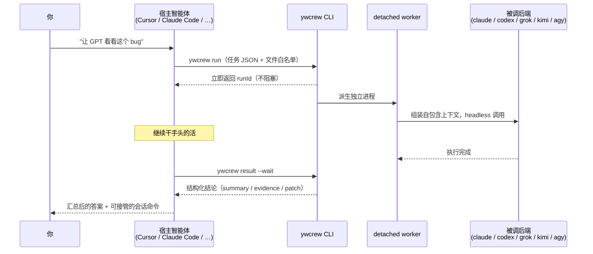

<div align="center">

# ywcrew

**让你的 AI 智能体们组成一个团队**

你本地订阅了 Claude Code、Codex、Grok、Kimi、Antigravity……<br>
ywcrew 让它们互相调用：在任何一个智能体里说句话，就能把任务派给其他家的模型。

[](./LICENSE)
[](https://nodejs.org)
[](./test)
[](#)

</div>

---

## 30 秒理解

装好之后，在 Cursor / Claude Code / Codex / Grok / Kimi 任意一个里，直接说：

| 你说 | 发生了什么 |
| --- | --- |
| "让 GPT 用最高思考强度查一下这个死锁" | 当前智能体把任务派给 Codex，后台执行，回来一份带证据的结论 |
| "开个评审会，对比一下这两个方案" | Claude、Codex、Kimi 并行各出一份评审，当前智能体汇总共识与分歧 |
| "让 kimi 接着刚才的结论继续深挖" | 跨轮追问，同后端原生续聊，KV 缓存零重建 |
| "让 claude 和 codex 各改一版，选好的" | 两家各自在隔离的 git worktree 里改代码，以 patch 交付，你挑一个 |

**三个关键保证：**

- **不烧 API key** —— 所有调用走你已付费的订阅（各家自己的 CLI 登录态）
- **不打断当前对话** —— 被调模型在独立进程里跑，主对话的缓存零污染
- **不碰你的代码** —— 只读任务有权限约束，改代码任务在隔离副本中进行、以 patch 交付

## 安装

**把仓库名发给你的智能体**（推荐），对任意 agent 说：

> 帮我安装 github.com/yuwen-cool/ywcrew：`npm install -g https://github.com/yuwen-cool/ywcrew/archive/refs/heads/main.tar.gz && ywcrew init --yes`，装完用 `ywcrew doctor` 告诉我哪些后端可用。

或者自己动手：

```bash
npm install -g https://github.com/yuwen-cool/ywcrew/archive/refs/heads/main.tar.gz
ywcrew init        # 交互式：探测本地 CLI → 确认默认模型/思考强度/评审会成员 → 分发技能
```

- 需要 Node ≥ 20；`init --yes` 为非交互模式（自动启用所有已登录的后端，绝不覆盖已有偏好）
- 升级：重跑同一条安装命令；`~/.ywcrew` 下的配置与偏好不受影响
- 无需构建、无需任何账号：`dist/` 已随仓库提供

## 工作原理



宿主智能体靠一份**按你的真实配置动态渲染的技能文件**学会这一切：里面只出现你实际启用的后端、你的默认模型、你自定义的路由偏好——它不会被引导去调一个你没有的模型。

回来的结论长这样（真实运行输出节选）：

```json
{
  "status": "ok",
  "summary": "发现 1 个 P0：PID 复用后 kill 会误杀无关进程组……",
  "evidence": [{ "file": "src/core/lock.ts", "lines": "46-58", "claim": "…" }],
  "confidence": "high",
  "usage": { "inputTokens": 525103, "outputTokens": 14624, "durationMs": 338466 },
  "takeover_command": "cd \"/path/to/proj\" && codex resume 019fa79b-…"
}
```

`takeover_command` 可以直接复制到终端，亲自接管子智能体的会话继续深聊。

## 支持的后端

| 后端 | 命令 | 思考强度 | 原生续聊 | 只读机制 |
| --- | --- | :-: | :-: | --- |
| Claude Code | `claude` | – | 支持 | `--permission-mode plan` |
| Codex | `codex` | 支持 | 支持 | `--sandbox read-only`（原生沙箱） |
| Grok | `grok` | 支持 | 支持 | `--permission-mode plan` |
| Kimi Code | `kimi` | – | 支持 | worktree 隔离（无原生只读档） |
| Antigravity | `agy` | 支持 | 支持 | `--mode plan` |

计划中的后端（opencode / droid / cursor-agent / 浏览器通道）见 [`docs/roadmap.md`](./docs/roadmap.md)。

## 命令速查

| 命令 | 作用 |
| --- | --- |
| `ywcrew run --stdin` | 派单个任务（任务 JSON，`ywcrew template` 看模板） |
| `ywcrew panel --stdin` | 同一任务并行发给多个模型（评审会；成员不可用自动降级） |
| `ywcrew followup <threadId> "…"` | 跨轮追问；`--backend` 换模型自动重建历史 |
| `ywcrew status / result <runId>` | 查状态 / 取结论（`result --wait` 阻塞等待多个 run） |
| `ywcrew route list/add/clear` | 查看/自定义任务路由偏好（写进各宿主技能） |
| `ywcrew doctor` | 体检：后端安装、登录态、宿主技能装载 |
| `ywcrew backends` | 列出可用后端与模型 |
| `ywcrew refresh` | 重新探测后端与模型清单，重渲染宿主技能 |
| `ywcrew install` | 把技能分发到各宿主的 skills 目录 |
| `ywcrew gc` | 清理超龄任务记录、worktree 与不活跃线程 |
| `ywcrew mcp` | 以 MCP stdio server 方式运行（可选接入方式） |

## 常见问题

**为什么不直接在主对话里切换模型？**
切模型会把当前对话的 KV 缓存整个打掉重建，又慢又贵。ywcrew 把被调模型放进独立进程，主对话缓存零污染，回来的只有结论。

**被调的模型能看到我的整个项目吗？**
只能看到你（或宿主智能体）明确圈定的文件白名单，且有 secret guard 拦截：凭据文件名单、路径逃逸拒绝、内容密钥特征扫描。它以 agentic 方式运行在项目目录（或隔离副本）中，读写边界由各家的权限档 + worktree 隔离双重约束。

**改代码的任务安全吗？**
edit 任务永远在隔离的 git worktree 里进行（你未提交的改动也会同步进去，保证它看到的是当前真实代码），产出以 patch 文件交付，绝不直接改你的仓库。

**任务跑一半我关掉编辑器会怎样？**
没影响。worker 是 detached 进程，状态全部落盘在 `~/.ywcrew`，随时回来 `ywcrew result <runId>` 取结论。

**多个任务同时跑会打架吗？**
有跨进程并发控制（每后端 + 全局双层槽位锁），排队自动进行；僵死任务有心跳检测和惰性回收。

## 设计要点

<details>
<summary>展开查看架构决策</summary>

- **CLI-first + 技能分发**：所有宿主都有 shell；技能文件按用户真实配置动态渲染，MCP 只是可选通道
- **任务五段式模板**：briefing / locations / objective / constraints / output_contract——被调模型对项目零知识，上下文质量决定结果质量；提示词层同时声明 agentic 环境与读写边界
- **无 daemon**：detached worker + 磁盘状态 + mkdir 原子锁（带初始化宽限与归属校验）+ 心跳惰性回收，宿主进程退出不影响任务
- **续聊双通道**：同后端原生 session resume（KV 缓存零重建）；跨后端按时间正序重建历史（预算封顶，旧轮折叠）
- **失败当场报**：未安装/未登录的后端、不存在的目录、零匹配的 glob、占位符模型名——全部在派单时拦截并给出下一步动作
- **多模型互审出厂**：发布前由 GPT 5.6 与 Kimi 各自完成一轮代码评审（就是用 ywcrew 自己派的单），P0/P1 全部修复

</details>

## 开发

```bash
npm install && npm run build   # tsup 打包到 dist/（dist 随仓库提交，改完 src 记得重新 build）
npm test                       # vitest 单测
npm run typecheck
```

## License

[MIT](./LICENSE)
